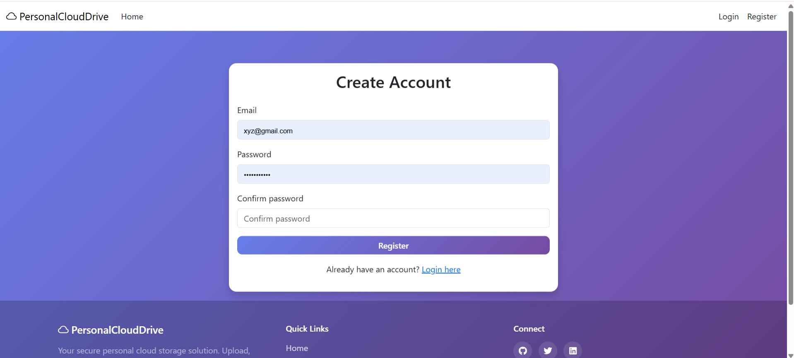

# Personal Cloud Drive

A modern, secure cloud storage solution built with ASP.NET Core MVC that enables users to manage, organize, and share files in a personal cloud environment.


## Features

- 🔐 **Secure Authentication**: Built-in user registration and login using ASP.NET Core Identity
- 📁 **File Management**: Upload, download, and delete files with ease
- 🗂️ **Folder Organization**: Create and manage folders with hierarchical structure
- 📊 **Storage Tracking**: Monitor storage usage with visual progress indicators
- 🎯 **Modern UI**: Responsive design with smooth animations and intuitive interface
- 🔒 **Security**: CSRF protection, secure file storage, and user isolation
- 📱 **Mobile Ready**: Works seamlessly on desktop, tablet, and mobile devices
- ⚡ **Performance**: Efficient file handling and async operations

This repository contains the complete source code and detailed instructions to run the project locally.

## Prerequisites

- .NET 9.0 SDK (download from https://dotnet.microsoft.com)
- SQL Server LocalDB (usually installed with Visual Studio) or SQL Server accessible and connection string updated in `appsettings.json`
  - If you don't have LocalDB, you can install it via the SQL Server Express installer or install the `SqlLocalDB` feature bundled with Visual Studio. On Windows you can also use the standalone LocalDB installer from Microsoft.
- (Optional) Visual Studio 2022/2023 or VS Code for development

## Setup and run

Open a terminal in the project root (for example `E:\Projects\PersonalCloudDrive`).

1. Restore and build

```powershell
# restore and build
dotnet restore
dotnet build
```

2. Update configuration

- The default connection string is set in `appsettings.json`:

```json
"ConnectionStrings": {
  "DefaultConnection": "Server=(localdb)\\mssqllocaldb;Database=PersonalCloudDrive;Trusted_Connection=True;MultipleActiveResultSets=true"
}
```

Change it if you need to use a different SQL Server instance.

3. Apply EF Core migrations (create database and schema)

```powershell
# create and apply migrations (if migrations already present this will ensure database is up to date)
dotnet ef database update
```

If `dotnet ef` is not available, install the tools:

```powershell
dotnet tool install --global dotnet-ef
```

If you need to create the initial migration locally (project already contains migrations in the `Migrations/` folder in this repo, so this is normally not required):

```powershell
# create a new migration (only if you modify the model and need a new migration)
dotnet ef migrations add InitialCreate
dotnet ef database update
```

4. Run the app

```powershell
dotnet run
```

Open a browser at https://localhost:5001 (or as printed in output) and register/login.

**Note:** You must register a new user account and log in before you can access the Dashboard and upload files.

## Uploads

Files uploaded are saved under `wwwroot/uploads/{userId}` by default. Upload path and limits are configured in `appsettings.json` under `StorageSettings`.

## Git instructions — push this project to your GitHub repo

If you want to push this project to `https://github.com/Meet1394/dotnet-project.git` do the following:

```powershell
# initialize git if not already initialized
git init
git add .
git commit -m "Initial commit - PersonalCloudDrive"

# add remote (replace URL with your repo URL)
git remote add origin https://github.com/Meet1394/dotnet-project.git

# push to GitHub
git branch -M main
git push -u origin main
```

If the remote already exists, you can instead set the URL:

```powershell
git remote set-url origin https://github.com/Meet1394/dotnet-project.git
git push -u origin main
```

## Project Structure

```
PersonalCloudDrive/
├── Controllers/          # MVC Controllers for handling requests
│   ├── AccountController.cs    # Authentication & user management
│   ├── DashboardController.cs  # File & folder operations
│   └── HomeController.cs       # Landing page & general routes
├── Models/              # Data models and viewmodels
│   ├── ApplicationUser.cs      # Custom user model
│   ├── FileModel.cs           # File entity
│   └── FolderModel.cs        # Folder entity
├── Views/               # Razor views for UI
│   ├── Account/              # Login & registration
│   ├── Dashboard/           # Main application interface
│   └── Shared/             # Layout & shared components
├── Data/                # Database context & migrations
├── wwwroot/            # Static files (CSS, JS, uploads)
└── Properties/         # Launch & configuration settings
```

## Advanced Configuration

### Storage Settings
Configure storage limits and paths in `appsettings.json`:

```json
{
  "StorageSettings": {
    "DefaultUserStorageLimit": 1073741824,  // 1GB in bytes
    "UploadPath": "wwwroot/uploads"
  }
}
```

### Security Configuration
Additional security settings can be configured:

```json
{
  "Security": {
    "RequireConfirmedEmail": false,
    "LockoutMaxFailedAttempts": 5,
    "PasswordRequireDigit": true,
    "PasswordRequireUppercase": true
  }
}
```

## Troubleshooting

### Common Issues

1. **Locked output file**
   - Error: Unable to start application because files are locked
   - Solution: Stop any running instances and try again
   ```powershell
   # Find and stop dotnet processes
   Get-Process dotnet | Stop-Process -Force
   ```

2. **Database Connection**
   - Error: Cannot connect to database
   - Check connection string in `appsettings.json`
   - Verify SQL Server is running:
   ```powershell
   sqllocaldb info
   sqllocaldb start MSSQLLocalDB
   ```

3. **Port Conflicts**
   - Error: Port already in use
   - Solution: Change port in `Properties/launchSettings.json` or use command line:
   ```powershell
   dotnet run --urls "https://localhost:5002"
   ```

4. **Missing EF Tools**
   - Error: 'dotnet ef' command not found
   - Solution: Install EF Core tools globally:
   ```powershell
   dotnet tool install --global dotnet-ef
   ```

### Production Deployment Notes

1. **Security**
   - Move connection strings to environment variables or secure storage
   - Enable HTTPS with valid SSL certificate
   - Configure proper authentication settings
   - Set up proper backup solutions

2. **Performance**
   - Configure appropriate storage quotas
   - Set up CDN for static files
   - Optimize database indexes
   - Configure proper logging

3. **Monitoring**
   - Set up application monitoring
   - Configure error logging
   - Set up usage analytics
   - Monitor storage usage

## Contributing

1. Fork the repository
2. Create your feature branch (`git checkout -b feature/AmazingFeature`)
3. Commit your changes (`git commit -m 'Add some AmazingFeature'`)
4. Push to the branch (`git push origin feature/AmazingFeature`)
5. Open a Pull Request

## License

This project is licensed under the MIT License - see the [LICENSE](LICENSE) file for details.

## Support

If you encounter any issues or have questions:
1. Check the [Issues](https://github.com/Meet1394/dotnet-project/issues) page
2. Create a new issue with detailed description
3. Contact the maintainers

---

Made with ❤️ using ASP.NET Core

## Screenshots

Here are screenshots from the running application. They help new users see how the app looks and behaves.

### Dashboard


### Register Page


### Sign In Page


### Storage View

